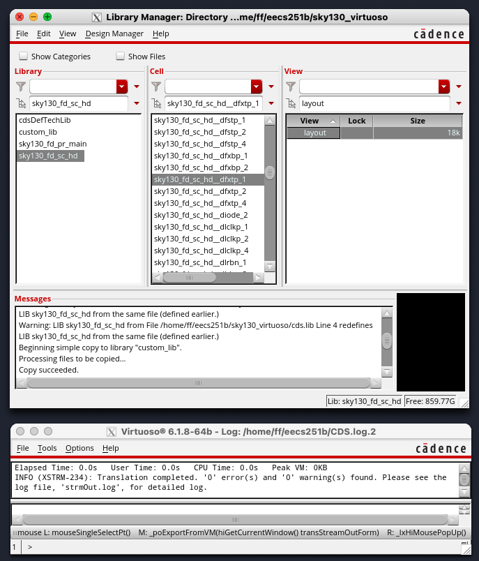
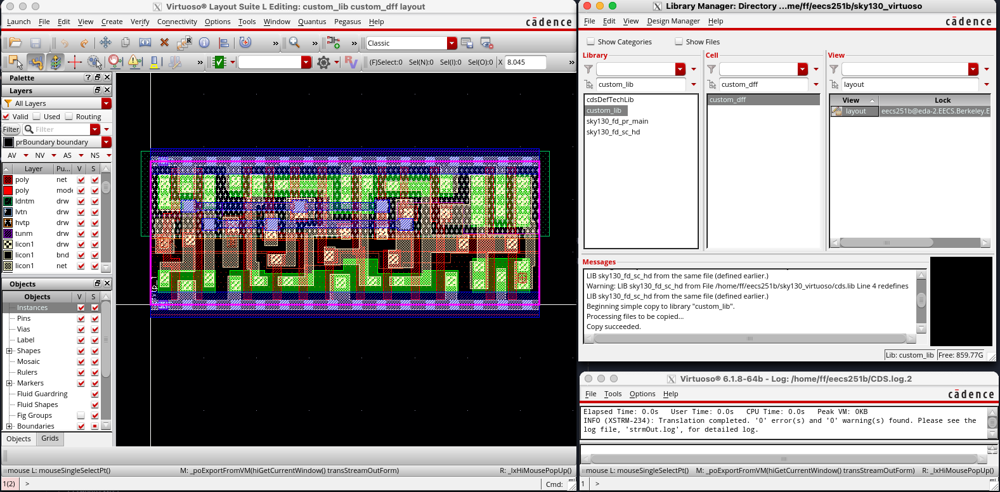
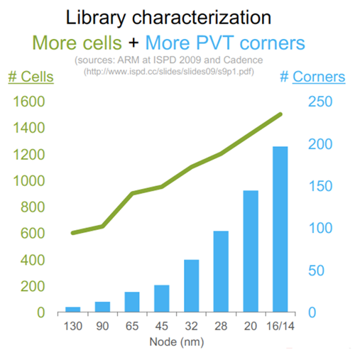
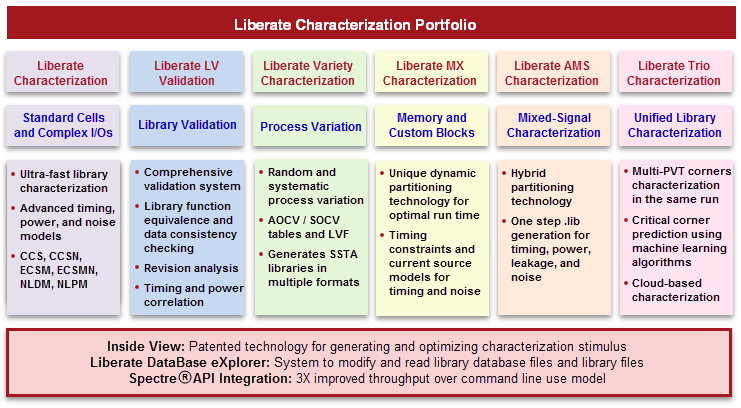
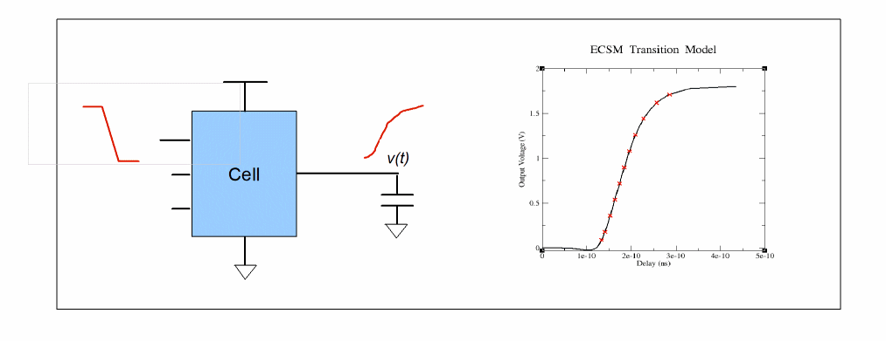
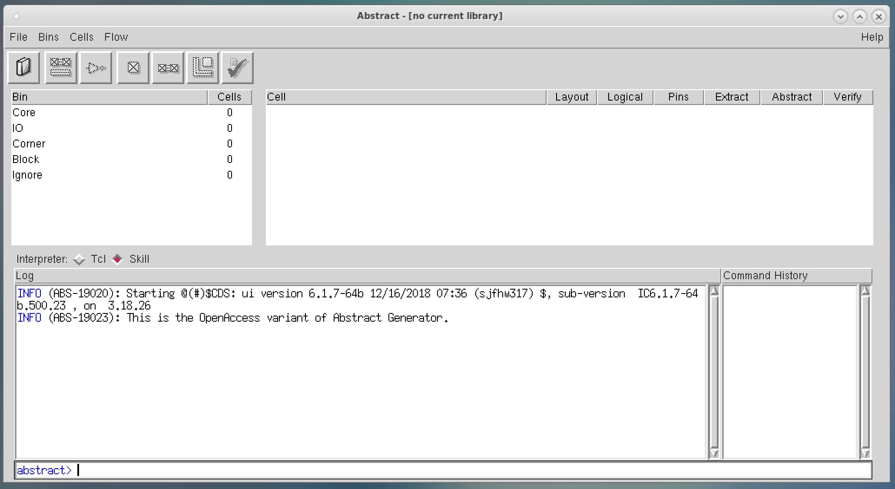

# Lab 4: Custom digital design

We will now explore the process for designing custom digital circuits. We'll start with
a flow that uses VLSI tools to produce a layout, then explore an alternative flow that
allows full manual control of the layout for improved performance and area.

## Getting started

First, pull the latest changes to the lab Chipyard repository:

```
cd /scratch/$USER/chipyard
source env.sh
git pull skeleton main
./scripts/init-vlsi.sh
```

## Decoder VLSI

The file `vlsi/lab4/decoder.yml` contains the Hammer inputs for the 4-16 decoder 
we will be working with.

Synthesis, PAR, and LVS all need to be run before you can proceed. 

```
cd vlsi
./lab4-vlsi syn -e env.yml -p tools.yml -p lab4/sky130.yml -p lab4/decoder.yml --obj_dir build/lab4
./lab4-vlsi syn-to-par -e env.yml -p build/lab4/syn-rundir/syn-output-full.json -o build/lab4/par-input.json
./lab4-vlsi par -e env.yml -p build/lab4/par-input.json --obj_dir build/lab4
./lab4-vlsi par-to-lvs -e env.yml -p build/lab4/par-rundir/par-output-full.json -o build/lab4/lvs-input.json
./lab4-vlsi lvs -e env.yml -p tools.yml -p build/lab4/lvs-input.json --obj_dir build/lab4
```

> [!IMPORTANT]
> **Question 1.** What do the `syn-to-par` and `par-to-lvs` steps do? What are their inputs and outputs?

For this lab, we are using the custom Hammer driver `lab4-vlsi`. Open `lab4-vlsi` and inspect its contents.

The file contains a `Eecs251bDriver` class that extends the base `HammerDriver` class, but
removes a couple of steps.
In addition to removing steps, you could conceptually use this file to add your own custom steps using
[hooks](https://hammer-vlsi.readthedocs.io/en/latest/Hammer-Use/Hooks.html). This is especially useful
for injecting custom TCL that doesn't fit into a Hammer API (any real tapeout will 
certainly have some custom TCL). 

> [!IMPORTANT]
> **Question 2.** Why do we need to remove the `clock_tree` step for this decoder? It may help to look
> at the Verilog at `vlsi/lab4/decoder.v`.

### Parasitic extraction (PEX)

We will be using Cadence Quantus to run parasitic extraction. Parasitic 
extraction will produce a netlist with more accurately modeled capacitances and
resistances for the nets in the design. We can then simulate this netlist
to get more accurate results than just the original post P&R netlist. 

We will manually run the PEX flow since Hammer does not yet have a Quantus plugin.
First, let us set up a run directory by running
the following in the `vlsi/` directory:

```
mkdir -p build/lab4/pex-rundir
cd build/lab4/pex-rundir
```

Using a text editor of your choice, create a file called `quantus.ccl` in `build/lab4/pex-rundir/` 
that contains the following contents:

```
extract -selection "all" -type "rc_decoupled"
input_db -type pegasus \
  -directory_name ../lvs-rundir \
  -run_name "decoder"
output_setup \
  -file_name "decoder.post.sp" \
  -net_name_space "SCHEMATIC" \
  -temporary_directory_name "decoder"
process_technology \
  -technology_directory "/home/ff/eecs251b/sky130/sky130_cds/sky130_release_0.0.4/quantus/extraction/typical"
```

Then, run the following command:

```
quantus -cmd quantus.ccl
```

This will output the post-extraction netlist to `decoder.post.sp`.

> [!IMPORTANT]
> **Question 3.** PEX adds additional resistors and capacitors to the netlist.
> Looking through `decoder.post.sp`, find one line that instantiates a resistor and another that instantiates
> a capacitor. Include both lines in your report. As a hint, resistor instance names start with `R` and capacitor
> instance names start with `C`.

> [!NOTE]
> It is recommended that you familarize yourself with basic SPICE syntax. [Here](https://eee.guc.edu.eg/Courses/Electronics/ELCT503%20Semiconductors/Lab/spicehowto.pdf) is one tutorial,
> but there are many others available online.

### Extracted simulation

We will now use Spectre to simulate post-extraction
decoder. 
If you are not familiar with Spectre, you can refer to the [reference manual](https://ee.kpi.ua/~yv/edu/ok/book/spectre_refManual.pdf) to learn about basic netlist syntax
and simulation commands.

We have supplied you with `decoder_testbench.sp`, which has the
testbench mostly setup for you already. Currently, it is intended that only `a0` is driven while the
remaining `a1-3` are held low (at `vss`). You will need to modify the connections to your decoder
since the port order of the post-extraction netlist is somewhat random. 

> [!WARNING]
> If you are not getting the expected results, double check your port ordering. SPICE is sensitive to
> port ordering, and new PEX runs can change the ordering that your decoder expects.

Once you have fixed the connections, you can run the following:

```
spectre decoder_testbench.sp
```

This should produce a number of output files including `decoder_testbench.mt0`.
This file includes desired measurements, such as the rise time `tplh` and the average
power `vdd_power`.
To view the waveforms produced by the simulation you can use Cadence Viva:

```
viva &
```

In the viewer that opens, click `File > Open Results`. Select the `decoder_testbench.raw` directory and click `Ok`. You should
now be able to click through the testbench hierarchy and add signals to the
waveform viewer.

> [!IMPORTANT]
> **Question 4.** Simulate the extracted decoder and measure the delay from `A[3]` rising 
> (the rest are 0) to `Z[8]` rising and the average power.
> Report the measured delay and average power, as well as the output load capacitance you used.
> You will need to modify the testbench
> such that A[3] is being driven and the other inputs are connected to ground.
> You may use the provided output capacitance if you would like, but it is always good to report delays
> with the output capacitance they correspond to.

## Custom design

> [!NOTE]
> The remainder of this lab will not be tied to Chipyard or Hammer. All of the relevant files will be included
> in this folder, which can be retrieved by running the following in your Lab 1 repo (the name should be
> something like `sp24-labs-$yourname`). If you did Lab 1 locally, you will need to redo the repo setup
> (cloning and adding a remote) on the instructional machines. 
>
> ```
> git pull skeleton main --allow-unrelated-histories
> ```
>
> For the remaining instructions, make sure you are in your lab repo, not your Chipyard repo.

Creating a custom cell involves creating a schematic (SPICE netlist)
and layout (GDS file), then verifying that the layout is manufacturable and matches the functionality
you expect. In the remainder of the lab, we will go through the process of creating and verifying a
SKY130 flip-flop.

Start by running the following commands from the root of your lab repo clone.

```
cd lab4/dff
virtuoso &
```

This will open Virtuoso's command intepreter window (CIW). Go to `Tools > Library Manager`
in order to open the Library Manager window, as shown in Figure 2.

<p align="center">
 
    <br>
    <em>Fig. 2 - Virtuoso</em>
    </br>
</p>

In the Library Manager, you will notice that there is a technology library called
`sky130_fd_pr_main`. This library has all of the PDK primitives such as transistors
and capacitors.

We will be running the flow on a standard cell from the `sky130_fd_sc_hd` library.
To import this library, go to the CIW (small window) and click `File > Import > Stream` with Stream File as 
`/home/ff/eecs251b/sky130/sky130A/libs.ref/sky130_fd_sc_hd/gds/sky130_fd_sc_hd.gds` 
and `sky130_fd_sc_hd` as the library. Attach it to `sky130_fd_pr_main` in the `Technology` dropdown and click 
`Apply`. This will stream in the layouts for standard cells in SKY130.

> [!NOTE]
> If you are unable to open the Library Manager in X2Go, you can try using SSH with X forwarding:
>
> ```
> ssh -AXY eecs251b-XXX@eda-X.eecs.berkeley.edu
> ```
>
> This may take some time to complete as it needs to start up XQuartz.
> When you start Virtuoso from your SSH terminal, a new window should open up in XQuartz.

### Schematic

The first step in designing a custom block is creating a schematic. This can be done in Virtuoso's schematic editor,
but it is often easier just to write a SPICE netlist. The SPICE netlist is provided for you in `lab4/dff/custom_dff.spice` and is taken directly from SKY130's 
[`sky130_fd_sc_hd__dfxtp_1` netlist](https://github.com/google/skywater-pdk-libs-sky130_fd_sc_hd/blob/main/cells/dfxtp/sky130_fd_sc_hd__dfxtp_1.spice).

> [!IMPORTANT]
> **Question 5.** Looking at the netlist, which transistors are connected to the output of the DFF? Include the lines
> from the netlist that you used to determine this.

### Layout

We will be starting with an existing DFF layout.

Begin by creating a new library by going to `File > New > Library` in the
Library Manager and name it `custom_lib`. Then select `Attach to an existing 
technology library` and choose `sky130_fd_pr_main`. 
In the library manager, go to
`sky130_fd_sc_hd`, right-click on `sky130_fd_sc_hd__dfxtp_1`, and click `Copy`. In 
the new window, change the `To` library to be `custom_lib` and the cell to be 
`custom_dff`, and click `Ok`. 

Open the layout viewer by clicking on your custom cell and double-clicking its layout view.


<p align="center">
 
    <br>
    <em>Fig. 3 - Virtuoso layout viewer</em>
    </br>
</p>

> [!IMPORTANT]
> **Question 6.** Are the PMOS transistors on the top or the bottom of the layout? As a hint, find out where
> the n-well drawing layer is.
>
>
> **Question 7.** You might notice that there are VDD and VSS rails on metal 1 at the top and bottom of the standard
> cell. Which one is which and how did you determine this? You can either reason this using your previous answer
> or by hiding all of the objects other than labels in the bottom left panel.
>
> **Question 8.** You should never do this outside of this lab, but draw a rectangle that shorts only the VDD and VSS rails by
> selecting the layer you want to draw on, hitting `R`, and clicking to define the corners of the rectangle. Take a screenshot of the layout with VDD
> VSS shorted, then undo your change with `U`. You will want to draw the rectangle on metal 1 drawing and avoid
> running into other internal routing done on the same layer. Your rectangle does not need to be DRC clean, this
> is just to show you how routing signals together is done in manual layout.

We will pretend like you made the layout from scratch in Virtuoso. To convert the layout into something
we can run DRC on, we must export it to GDS. After reverting any changes you made, go to 
`File > Export Stream from VM` in the layout viewer window. This will create a `custom_dff.gds` file 
in your `lab4/dff/` directory that contains the layout
of your cell.

### DRC

To run DRC, run the following commands in your `lab4/dff/` directory:

```
mkdir drc
cd drc
pegasus -drc -dp 12 -license_dp_continue -gds ../custom_dff.gds -top_cell custom_dff -ui_data \
  /home/ff/eecs251b/sky130/sky130_cds/sky130_release_0.0.4/Sky130_DRC/sky130_rev_0.0_1.0.drc.pvl
```

To open the results viewer, run the following:

```
pegasusDesignReview -qrv -data ../custom_dff.gds &
```

Then, click `Pegasus > Open Run` and select the file ending with `.drc_errors.ascii` (the name may look a little
random).

> [!IMPORTANT]
> You might notice that there are several licon.12 errors. **Ignore these.** They are due to the fact that the Cadence SKY130 drc deck is stricter than the actual foundry rules. If you were to sign off on this design, you will run a different DRC deck that will waive these errors.

> [!IMPORTANT]
> **Question 9.** Read the non-licon DRC error and explain what the error is. What is the purpose and
> operation of a tapcell? You can look at an SKY130 tapcell layout in the the same
> `sky130_fd_sc_hd` library we copied the DFF layout from.

### LVS

To run LVS, run the following commands in your `lab4/dff/` directory:

```
mkdir lvs
cd lvs
pegasus -lvs -dp 12 -license_dp_continue -automatch -check_schematic -rc_data -ui_data \
  -source_cdl ../custom_dff.spice -gds ../custom_dff.gds -source_top_cell custom_dff -layout_top_cell custom_dff \
  /home/ff/eecs251b/sky130/sky130_cds/sky130_release_0.0.4/Sky130_LVS/sky130.lvs.pvl
```

> [!IMPORTANT]
> **Question 10.** Take a screenshot of the LVS output that shows that layout and schematic match.

### PEX

To run PEX, set up a run directory by running the following from your `lab4/dff/` folder.

```
mkdir pex
cd pex
```

Using a text editor of your choice, create a file called `quantus.ccl` in `lab4/dff/pex/` 
that contains the following contents:

```
extract -selection "all" -type "rc_decoupled"
input_db -type pegasus \
  -directory_name ../lvs \
  -run_name "custom_dff"
output_setup \
  -file_name "custom_dff.post.sp" \
  -net_name_space "LAYOUT" \
  -temporary_directory_name "custom_dff"
process_technology \
  -technology_directory "/home/ff/eecs251b/sky130/sky130_cds/sky130_release_0.0.4/quantus/extraction/typical"
```

Then, run the following command:

```
quantus -cmd quantus.ccl
```

### Extracted simulation

Finally, we will do a couple more simulations to compare the extracted netlist to the original netlist.
You should be able to use a very similar testbench to the one
used earlier for the decoder. We have included an example Spectre testbench at
`lab4/dff/dff_testbench.sp` that may be useful to you. 

> [!WARNING]
> Make sure to check the ordering
> of the ports of your post-extraction DFF netlist. The VNB port, which corresponds to NMOS bodies, should
> be connected to ground. Conversely, the VPB port corresponding to PMOS bodies should be connected to VDD.

> [!IMPORTANT]
> **Question 11.** Estimate the CLK-Q time of your DFF for a rising Q transition using both the pre-extraction (`custom_dff.spice`)
> and post-extraction (`pex/custom_dff.post.sp`) netlists. Compare the two times and provide an explanation
> for your observations.
> State the load capacitance and rise/fall times you used.

> [!NOTE]
> Instructions on opening waveforms
> using Cadence Viva can be found in the extracted simulation section for the [decoder](#decoder-vlsi).

You can also extend the given testbench to characterize the setup time of your DFF.

The measurement can be performed by varying the D-CLK time in the testbench. If you start
with the data launch well before the clock rising edge, CLK-Q delay will only change
slightly. However, as the data edge draws closer to the clock edge, CLK-Q delay will rapidly increase until the data output can no longer be observed.

In this lab, we will use the definition of setup time as the D-CLK delay, at which the new CLK-Q delay is 1.05 times the old CLK-Q delay that you measured in Question 11.

You will learn more about the setup time during the lecture.

> [!IMPORTANT]
> **Question 12.** Modify `dff_testbench.sp` to estimate the setup time of your DFF using only the
> extracted netlist. State the load capacitance and rise/fall times you
> used, even if they are the same as the provided numbers. 
> Also, include a screenshot of the waveforms of CLK, D, and QN for the
> simulation that you determined the setup time from. 
>
>
> **Question 13.** Compare your setup time result to the timing parameters for
> `sky130_fd_sc_hd__dfxtp_1` in
> `/home/ff/eecs251b/sky130/sky130A/libs.ref/sky130_fd_sc_hd/lib/sky130_fd_sc_hd__tt_025C_1v80.lib`.
> Copy the entire section of the lib (starting at "timing () {}") that
> corresponds to the setup time and try to guess why it is presented as a look-up
> table instead of a single value. As a hint, you
> can find the table units and templates at the top of the file, and then find the
> timing lookup tables for CLK-Q, setup, etc. by searching for the
> `sky130_fd_sc_hd__dfxtp_1` entry.

## Generating Collaterals
We will now explore how to generate abstract views of a custom cell so that
synthesis and P&R tools can integrate your design.
For example, synthesis and P&R tools must be able to calculate path delay without
running a Spice simulation itself, necessitating timing models. Similarly, P&R
only cares about the boundary, pins, and blockages of cells instead of the
entire transistor-level layout, necessitating layout abstracts. We will see how
to generate both types of abstractions, timing and physical, from a custom
circuit.


## Characterization and Abstraction in the Custom Design Flow

A typical standard cell library contains many types of logic cells.
Each of these cells has a different function and therefore
different timing parameters (beyond just setup time). Furthermore, it is important to
know how much power each cell consumes, so that the synthesis and P&R tools can
minimize overall power consumption. For each cell, we must at the very minimum
measure delays (for combinational blocks) or setup and hold times (for sequential blocks)
at multiple operating conditions (process,
voltage, and temperature). With ever-increasing complexity and end-applications,
successively smaller CMOS nodes have required characterizing an exponentially
larger set of cells and operating conditions, as shown in below.


<p align="center">
 
    <br>
    <em>Fig. 4 - Exponential Growth in Library Characterization</em>
    </br>
</p>

In the following sections, we will generate Liberty Timing Files (LIBs) and Library Exchange
Format files (LEFs), the two main types of collateral for the VLSI flow.

## Cadence Liberate

Cadence Liberate is a tool that analyzes the function of digital circuits and
produces "electrical views", which contain all the relevant timing relationships
between pins, power consumption information, and more. It accomplishes this
by intelligently finding timing arcs, setting up Spice simulations, and
measuring parameters like delay and currents automatically, thereby vastly
improving the time it takes to prepare a cell for the digital VLSI flow.

A summary of all the things that various Liberate tools can characterize is
shown in below. This picture is taken from the reference manual at
`/share/instsww/cadence/LIBERATE/doc/liberate/liberate.pdf`. In this lab, we
will use Liberate Characterization to generate LIBs for our flip-flop.

<p align="center">
 
    <br>
    <em>Fig. 5 - The Complete Cadence Liberate Suite</em>
    </br>
</p>

### LIB Files

Liberty Timing Files (LIBs) are an IEEE standard. A very high-level
introduction of the key parameters and format of the standard is described
[here](https://redirect.cs.umbc.edu/~cpatel2/links/641/slides/lect05_LIB.pdf)
which corresponds to a basic timing model called the Non-Linear Delay Model
(NLDM). It is a simple lookup table-based model which describes delays and
rise/fall times for various input waveforms and output loads that results in
small LIB files at a moderate accuracy loss compared to a Spice simulation.

With deeply-scaled technologies, however, switching events actually generate
significant transient current and voltage spikes, which can cause glitching on
critical and neighboring nets. As a result, additional LIB models are needed to
accurately model these effects, namely Composite Current Source (CCS) and
Effective Current Source Model (ECSM), which non-linearly sample the output
current and voltage waveforms, respectively, and are shown in Figs 7 and 8. CCS
models are generally used for Synopsys VLSI tools (Design Compiler, IC
Compiler), while ECSM models are generally used for the Cadence tools that we
have used so far.

Finally, there are additional things to characterize:
power, noise immunity, signal integrity, process variation, and electromigration.
Liberate will by default analyze power and its importance is self-explanatory,
but the latter few are used to ensure product reliability.

<p align="center">
 
    <br>
    <em>Fig. 6 - Composite Current Source Model</em>
    </br>
</p>

<p align="center">
 
    <br>
    <em>Fig. 7 - Effective Current Source Model</em>
    </br>
</p>

### Generating LIBs

First, navigate to `lab4/characterization`. Inside, there are a few TCL files and a
Makefile. Let's go through them one-by-one to see how Liberate works in order
to characterize our "custom" flip-flop. We will also then compare it against
the LIB that comes from the PDK, which is located at
`/home/ff/eecs251b/sky130/sky130A/libs.ref/sky130_fd_sc_hd/lib/sky130_fd_sc_hd__tt_025C_1v80.lib`.

The Makefile is very simple. You can see that `CELL_TYPE` is set to `DFF`,
which passes `char_DFF.tcl` to the `liberate` command. This TCL file is set up
for characterizing D flip-flops.

`char_DFF.tcl` is divided into a few short sections:
1. It sources a template file `template_sky130.tcl` that we will look at
   next.
2. You then choose between 3 PVT corners (typical, fast, and slow).
   These PVT corners correspond to some of the corners that were
   characterized by the developers of the SKY130 PDK. The relevant SKY130 Spice
   transistor model file is selected based on the process corner.
3. You then specify the names of the D flip-flops that you want to characterize
   for this LIB, read the PEX netlists for those cells, and define I/O and
   template parameters of this cell family, which denotes that `CLK` is the
   clock port, `D` is an input port, `Q` is the output port, and some
   delay/constraint/power templates (see below).
4. Finally, the cells are characterized at the chosen PVT corner and written to
   a `.lib` file.

`template_sky130.tcl` sets some base units and a bunch of variables and
templates that are actually generated from the source LIB for the flip-flop we
are analyzing (`sky130_fd_sc_hd__dfxtp_1`). Here's what the variables
mean (summarizing from the reference manual):
- `(measure_)slew_lower/upper_rise/fall`: Together, these 8 variables pass
  through to the output LIB and tell Liberate that output transition time
  values are measured between 10% to 90% of the supply voltage.
- `delay_inp/out_rise/fall`: Together, these tell Liberate to measure the delay
  from an input to output for both edges at the 50% of supply voltage point.
- `def_arc_msg_level` and `process_match_pins_to_ports`: These tell Liberate to
  throw an error if no valid arcs are found and if the pin list is incorrect.
  This can help detect a mismatched `define_cell` command setup relative to
  the cell being characterized.
- `max/min_transition`: These get encoded in the LIB as a min/max bound for
  transition times on any pin. These values are passed onto synthesis and P&R
  to prevent them from sizing driving cells and loads too large or small.
- `min_output_cap`: This sets the minimum output load during the
  characterization simulations.
- `define_template -type delay`: This is a table for delay characterization for
  various values of input slew (`index_1`) and output load
  (`index_2`). It is named `delay_template_7x7` which the delay
  tables will refer to in the generated LIB.
- `define_template -type constraint`: This is a table for timing constraint
  (setup, hold, etc.) characterization. Here, `index_1` is a range of input
  slews on the data and `index_2` is a range of input slews of the reference
  signal (clock, reset, etc.).
- `define_template -type power`: This is a table for switching and internal
  power consumption. Here, `index_1` is a range of input slews and `index_2` is
  a range of output loads.

For more information about LIB syntax, you may find the [Liberty Reference Manual](https://people.eecs.berkeley.edu/~alanmi/publications/other/liberty07_03.pdf) useful.

> [!IMPORTANT]
> **Question 14.** What is the benefit of specifying min/max transition times? Hint:
> think about signal integrity and crowbar currents.
>
>
> **Question 15.** For larger D flip-flops (i.e. larger internal transistors and output
> drive strengths), which template tables might we want to change, and how might we change them?

Now, let's generate the LIB. Copy or symlink the PEX netlist for your
flip-flop from earlier into this `characterization` folder.

```
cp lab4/dff/pex/custom_dff.post.sp lab4/characterization/custom_dff.pex.netlist
```

Ensure the extracted netlist is named `custom_dff.pex.netlist`.
Due to differences between Calibre and Spectre, we will need to make
a few changes to the netlist.
Open `custom_dff.pex.netlist` in a text editor and look for lines that look like this:

```
MM0 VGND#20 CLK#5   4#23    VNB nfet_01v8   L=1.5e-07
+ W=4.2e-07
```

Change this to:

```
XM0 VGND#20 CLK#5   4#23    VNB nfet_01v8   L=1.5e-07
+ W=4.2e-07
```

Note that we changed the first character of the first line from `M` to `X`.
Repeat this for all elements in the netlist that start with M.
Hint: you can use an appropriate command in Vim or sed to perform all the required changes.
For more information on SPICE syntax, you can peruse [this webpage](https://www.seas.upenn.edu/~jan/spice/spice.overview.html).

Save your changes to the netlist, then run:

```
make gen-libs
```

After a few (5-10) minutes, it will output a `DFF_<PVT corner>.lib` file, as
well as a log file. Open up the generated LIB to compare against the PDK's
LIB, then answer these questions:

> [!IMPORTANT]
> **Question 16.** Glance through the two LIBs and note any high-level differences between
> the characterization results of your flip-flop and the PDK's `sky130_fd_sc_hd__dfxtp_1`.
> The PDK's lib file is `/home/ff/eecs251b/sky130/sky130A/libs.ref/sky130_fd_sc_hd/lib/sky130_fd_sc_hd__tt_025C_1v80.lib`.
>
>
> **Question 17.** Repeat the characterization for the PVT corners that would be used for
> setup and hold analysis (which corners are these, respectively?).
> You can change the corner being characterized by editing `char_DFF.tcl`
> and rerunning `make gen-libs`. Show some
> general comparisons of setup/hold timing and active/leakage power between these
> LIBs and the typical PVT corner LIB we generated first.

## Cadence Abstract

Cadence Abstract is a tool attached to Virtuoso that generates a layout
abstraction for P&R tools. An abstract is a high-level representation of a
layout view, containing information about the type and size of cells, positions
of pins, and the size and type of blockages. These abstracts are used in place
of full physical layouts so that P&R tools can have better performance. In the
P&R process, only the bare minimum information is needed for it to know where
it is allowed to place cells and how to route to them; extracting this
information from the full layouts would consume excess resources. Finally, if
you want to integrate some IP into your chip, whether it is SRAM, data
converters, etc., abstracts are a way to keep everything inside the IP as a
blackbox from the perspective of the physical design flow. 

A summary of the Abstract tool and instructions are found in the documentation
at `/share/instsww/cadence/IC617/doc/abstract/abstract.pdf`. If you are going
to generate more complex abstracts for your project, this is very important to
reference. In this lab, we will use Abstract to generate LEFs for our
flip-flop.

### LEF Files

Library Exchange Format (LEF) is an open industry standard that was developed
by a company that has since been acquired by Cadence. It is an ASCII text
format and is often used in conjunction with the very similar Design Exchange
Format (DEF) files in order to fully describe abstract layouts. An introduction
to LEF can be found
[here](https://www.csee.umbc.edu/courses/graduate/CMPE641/Fall08/cpatel2/slides/lect04_LEF.pdf)
and the full LEF/DEF Language Reference Manual can be found at
`/share/instsww/cadence/IC617/doc/lefdefref/lefdefref.pdf`.

In general, VLSI tools need to take a set of abstracts that in aggregate
describe the basic technology rules and information about all macros to be
used. In the LEF specification, technology rules are specified in a technology
LEF that will contain definitions of layers, manufacturing grids, vias, and
sites (i.e. the standard cell unit height/width). Macro information is
specified in separate LEFs that contain definitions of class (type of cell),
size, symmetry, pins, and obstructions (i.e. areas not available for routing).
We will now explore how to generate the latter type of LEF.

### Generating LEFs

Open an SSH session with X window forwarding by adding `-AXY` to your SSH command:

```
ssh -AXY eecs251b-xyz@eda-N.eecs.berkeley.edu
```

Substitute your username and preferred EDA machine into the command above.
Alternatively, you may open a terminal inside an X2Go session.

Run the following command in `lab4/dff`

```
abstract &
```

When you open Abstract GUI, it should look like this:

<p align="center">
 
    <br>
    <em>Fig. 8 - Correctly Displayed Abstract</em>
    </br>
</p>


Be advised that Abstract is quite an old tool, and may display like this in
your X2Go session, where a lot of the menu text is invisible:

<p align="center">
 
    <br>
    <em>Fig. 9 - Incorrectly Displayed Abstract</em>
    </br>
</p>

There are 2 possible solutions. The first is to shutdown your existing X2Go
session and re-install your X2Go with all legacy fonts, as shown here for a
Windows installer:

<p align="center">
 
    <br>
    <em>Fig. 10 - Selecting Legacy Fonts in X2Go Installer</em>
    </br>
</p>

The other solution is to rely solely on X11 forwarding over an SSH terminal,
which may be slow and cause you to lose your work if the connection drops.

Take a look at the toolbar buttons -- these correspond to the steps needed to
generate an abstract. We are going to go through them from left to right:

1. Click the Library button (looks like a book). Select the Virtuoso library
   that contains your custom DFF (this should be called `custom_lib`).
   You should see that the `custom_dff` cell
   appears on the right pane -- click on it to select it. You should also see 1 cell in the
   `Core` "bin" on the left pane. The bins correspond to the types of cells
   that the LEF specification defines; for a standard cell that we have it
   should be in the `Core` bin, but for things like larger IP blocks, you would
   want them in the `Block` bin.  To do this, you would select the cell, go to
   `Cell` > `Move`, and select the destination bin.

2. Click the Layout button (looks like 2 wires and 2 vias). This is used to
   import a layout from a GDS file, such as if somebody else gave you a
   finished layout in GDS format and not as a Virtuoso library. Since our
   flip-flop already has a layout view in Virtuoso, we can hit Cancel out of
   this dialog box.

3. Click the Logical button (looks like an inverter symbol). This tells the
   tool what the pins are. Since we just generated a LIB, select `LIB` as the
   Filetype and browse to the LIB you just created. We'll select the lib for the TT corner,
   but it does not matter which corner you use. This step only looks at the pins
   exposed by our flip flop, which do not change across PVT corners.
   For other cells, we can
   also import Verilog shells instead, which would just define the module and
   ports but does not need implementation.

4. Click on the Pins button (a square with an X inside). This is where we
   select options for how to extract pin shapes from the pin labels in the
   layout view and pin directions from the logical view. There are 4 tabs: Map,
   Text, Boundary, and Blocks.
   
   - In the Map tab, under the field "Map text labels to pins", type
     `(li1 li1) (met1 met1) (met2 met2) (met3 met3) (met4 met4) (met5 met5)`
     This means that all pin labels on each layer
     are mapped to shapes on the same layer. Leave the other fields
     as-is.
   - In the Text tab, do not change anything. However, this can be used if you
     want to use regex to change the pin names between the layout and abstract
     view (e.g. bus bit designators).
   - In the Boundary tab, check that `li1` is included in the list of layers under "using geometry on layers".
     Here, the listed layers will
     designate the rectangular P&R boundary of the cell we want to extract.
     With the "as needed" option, it will create a boundary only if a
     `prBoundary` shape is not defined in the layout view. Other designs
     may want to restrict the layers used.
   - In the Blocks tab, do not change anything. This is only used to process
     pre-routed layouts that are imported from a DEF file.
  
    Now, click Run. The abstract log should tell you that 5 pins have been
    created.

5. Click on the Extract button (like the Layout button without the wire
   underneath). This is used to trace the connectivity between shapes and
   terminals, and also generate antenna data.
   There are 4 tabs: Signal, Power, Antenna, and General.
   In the first 3 tabs, for each layer, there exists a
   "Geometry Specification" field. For advanced usage, you can generate Boolean
   functions of multiple layers to define connectivity layers.

   Make the following changes:

   - Under "layer assignment for signal extraction" in the "Signal" tab,
     create (or edit, if it's already there) an entry for `li1` with `Strong` connectivity
     and "create pins" enabled. Also enter `li1` as the geometry specification.
   - Do the same for `li1` in the "Power" tab.
   - In the "General" tab, ensure that there is a tuple `(li1 met1 mcon)`.
   
   Here are some other pointers for advanced usage later on:
  
   - Must connect pins are for situations where the same pin name exists in
     disjoint locations (i.e. not internally connected), and must be connected
     together in P&R, which recognizes the `MUSTJOIN` specification.
   - Antenna extraction is necessary for larger blocks with pins that have long
     wires. This information is used for P&R to decide whether it needs to do
     things like switch layers to avoid antenna violations. This is beyond the
     scope of this lab.
   - The layer connectivity list in the General tab is very important to get
     right. By default, this is filled in correctly and lists the via layers
     that join adjacent metal layers.
  
   Now, click Run. The abstract log should tell you that all 5 nets have been
   extracted.
  
6. Click on the Abstract button (square nestled in an L-shape route). This step
   adjusts pins and creates blockages, overlaps, and grids. There are 7 tabs:
   Adjust, Blockage, Density, Fracture, Site, Overlap, and Grids.
   
   - In the Adjust tab, do not change anything. However, for larger designs
     (such as analog blackboxes), you will often want to select the "Create
     boundary pins" option to confine the generated pin shape to a square
     abutting the P&R boundary rather than over the entire block (prerequisite
     is that all pins are routed to the edge of the boundary).
   - In the Blockage tab, we encode how shapes on various layers turn into
     blockages. For this flip-flop, ensure that there is a row for `li1` in the
     "layer assignment for blockages" table with "Blockage" set to `Detailed`.
     No other changes are necessary here;
     however, for larger designs (such as analog blackboxes), this is a very important tab.
     There are 3 types of blockages that can be generated for each layer:
     detailed, shrink, and cover. `Detail` generates a blockage shape
     for every piece of geometry on that layer -- this is useful only for
     standard cells and the topmost layers of large blocks. `Shrink`
     fills in the smaller, less useful spaces between shapes, which would allow
     for over-the-cell routing without modeling each obstruction in detail.
     `Cover` generates an obstruction covering the entire block for that
     layer, which is used for layers which should be off-limits for the P&R
     tool. In general, you want to cover as much of your block as necessary,
     and only expose in shrink or detail the layers that are available for P&R
     to do routing on. This both increases the efficiency of P&R and reduces
     the chances that routing will cause DRC/LVS issues with the abstracted
     block. In the extreme case, analog IP with structures like inductors at
     the top-level need to cover block all layers, exposing only boundary pins.
     Additional advanced options in this tab will generate cutouts around pins
     and create routing channels on cover block layers.
   - In the Density tab, do not change anything. This is used to encode density
     information, which is particularly helpful to help automatic fill tools
     achieve required min/max density without needing to calculate it from the
     full layout of any blackboxes.
   - In the Fracture tab, do not change anything. This is used to fracture pins
     and blockages from polygons to rectangles if required for certain P&R
     tools.
   - In the Site tab, for the site name, enter `unithd`. This is
     required for cells in the `CORE` bin like our flip-flop in order to
     tell the tool that it belongs to the `unithd` site, like for all `sky130_fd_sc_hd`
     standard cells that need to be placed in ordered rows. For other types of
     cells, do not do this.
   - In the Overlap tab, do not change anything. This is particularly useful
     for larger designs where you want to generate a second, more detailed
     boundary that is a rectilinear polygon. This overlap layer can be
     generated from specific layers and will be used to test if cells truly
     overlap when in P&R they are placed with overlapping boundaries.
   Now, click Run. The abstract log should tell you that blockages are created
   for each layer and do a power rail analysis.

> [!NOTE]
> You might not be able to modify site tab or see grids tab. Since our flip-flop doesn't belong to CORE site, you won't be able to modify site tab.
> You might also see Grids tab. This is a tool to help check if all geometry (wires and pins) are properly on the manufacturing grids, which is useful for standard cells but less so for larger designs. Our flip-flop is already fine, so we can skip this tool.

> [!IMPORTANT]
> **Question 18.** Why do we generally only want to generate pin shapes on metal layers,
and not layers such as n-well and p-substrate?
>
>
> **Question 19.** Say we want to abstract an SRAM block with signal and power pins on M3 and
> all internal routing on M3 and below. For which layers should we generate
> cover, shrink, and detailed blockages? Should we create boundary pins for
> signal nets? What about for power nets?
>
>
> **Question 20.** Why are there minimum and maximum density requirements for every layer
> in a technology stackup?
> 
>
> **Question 21.** Read the Overlap Tab section in the Abstract manual and
> explain the Overlap layer. The Abstract manual is
> `/share/instsww/cadence/IC618/doc/abstract/abstract.pdf`.
> Provide a simple drawing of a case where creating an Overlap layer
> would be beneficial (Hint: During the placement optimization phase, P&R tools detect
> cell boundaries and their overlaps and penalize any overlaps).

> [!NOTE]
> You can open PDFs on the EDA machines by running `evince file.pdf &`.
> Make sure you run this from an SSH session with X forwarding enabled (`-AXY`)
> or from a terminal within an X2Go session.


Finally, we are ready to export the LEF. Go to `File` > `Export` > `LEF`. In
the window that appears, set the LEF filename to `custom_dff.lef` (or
something else of your choosing). Select 5.8 as the LEF version, then hit OK.

Now, open the LEF you just created alongside the LEF provided in the PDK at
`/home/ff/eecs251b/sky130/sky130A/libs.ref/sky130_fd_sc_hd/lef/sky130_fd_sc_hd.lef`.
In the latter file, scroll down to the part that starts with 
`MACRO sky130_fd_sc_hd__dfxtp_1`.

> [!IMPORTANT]
> **Question 21.** Compare the LEF you generated to the LEF provided in the PDK
> by opening both LEFs in a text editor (e.g. `vim`) and looking for differences.
> Identify at least 3 differences. Would the LEF you generated allow P&R
> tools to place your DFF into a `unithd` site?
> If not, why not? What might we need to change when generating the abstract?
> Hint: compare the size in your generated LEF to the size declared by the PDK LEF,
> and think about what might cause the difference.
>
>
> **Question 22.** Notice how the LEF says `USE CLOCK` for the `CLK` pin.
> How did Abstract know it's a clock pin, and what would we do differently to make it just a signal?
>
>
> **Question 23.** The `OBS` section contains our detailed obstructions. What would it look like
> if instead we did COVER for layer met1? Why might this pose problems for us in
> P&R? What about COVER for layer via?

All the the steps we took in the Abstract GUI have actually been recorded for
us. In the directory of the library containing the flip-flop, there is a
`.abstract.options` file. This file contains all of the options corresponding
to the current state of our Abstract GUI after all of our changes. In the
directory in which you launched Abstract, there is a `abstract.record` file.
This file contains the commands corresponding to the steps we took. In the
future, you can take and modify these two files in order to run Abstract from
the command line (see the section "Log, Replay, and Record File Behavior" in
the Abstract user guide).

Finally, in the Virtuoso library, for the `custom_dff_R` cell, there is now an
`abstract` view. We can open this in the Virtuoso layout editor!

> [!IMPORTANT]
> **Question 24.** Submit a screenshot of the abstract view of the flip-flop, as viewed in Virtuoso.

## Adding an extra library in Hammer

Using the views we have created in this lab, we can integrate our custom block
into Hammer's VLSI flow.

### Verilog

It is sometimes useful to generate a Verilog model of our block from the netlist.

There are two cases where Verilog is used. The first is for synthesis, which
are just wrappers and are needed for blackboxes (e.g. SRAMs, analog IP). This
can be generated using Liberate with the `write_top_netlist` command (see the
manual or type `help write_top_netlist` for details). More often, it is done
manually in your source netlist, since only the port list needs to be defined.

The second case is for simulation. This Verilog file would describe the
behavior of the design, and is often hand-written along with your design during
functional verification.

### Including the views

To ensure that the Hammer flow knows about our new custom cell, we would need
to append to the list of `vlsi.technology.extra_libraries`.

As an example, the snippet below shows how to integrate a dummy
DCO (digitally-controlled oscillator) in the ASAP7 predictive PDK.
To round it out for the whole
flow, you would also include `spice netlist` for LVS, `verilog synth` for
synthesis (if not already included in your source Verilog), and `verilog sim`
for simulation.

```yaml
vlsi.technology.extra_libraries_meta: ["append", "deepsubst"]
vlsi.technology.extra_libraries:
  - library:
      nldm_liberty_file_deepsubst_meta: "local"
      nldm_liberty_file: "extra_libraries/example/ExampleDCO_PVT_0P63V_100C.lib"
      lef_file_deepsubst_meta: "local"
      lef_file: "extra_libraries/example/ExampleDCO.lef"
      gds_file_deepsubst_meta: "local"
      gds_file: "extra_libraries/example/ExampleDCO.gds"
      corner:
        nmos: "slow"
        pmos: "slow"
        temperature: "100 C"
      supplies:
        VDD: "0.63 V"
        GND: "0 V"
  - library:
      nldm_liberty_file_deepsubst_meta: "local"
      nldm_liberty_file: "extra_libraries/example/ExampleDCO_PVT_0P77V_0C.lib"
      lef_file_deepsubst_meta: "local"
      lef_file: "extra_libraries/example/ExampleDCO.lef"
      gds_file_deepsubst_meta: "local"
      gds_file: "extra_libraries/example/ExampleDCO.gds"
      corner:
        nmos: "fast"
        pmos: "fast"
        temperature: "0 C"
      supplies:
        VDD: "0.77 V"
        GND: "0 V"
```
## Conclusion

This lab wraps the introduction to custom design flow, where we discussed about how to create, pipeclean (DRC/LVS), PEX simulate, and creating collaterals (LIB, LEF) that specify the timing and pin location of a custom cell.

## Deliverables

Push your changes to the following files. Do not push any generated files as these will clutter up your repo.

Chipyard repo:
- `vlsi/lab4/decoder_testbench.sp`

Lab repo:
- `lab4/dff/dff_testbench.sp`: Should contain your testbench for determining setup time.
- `lab4/characterization/DFF_$PVT.lib`: Should contain the characterized LIB for your DFF.
- `lab4/dff/custom_dff.lef`: Should contain the LEF for your DFF.

Submit your answers to all of the questions to Gradescope. When taking screenshots, make sure to include
something that identifies that the screenshot is yours (e.g. a path to your repo or your terminal prompt).

## Acknowledgement

Thanks Rohan Kumar and Elam Day-Friedland for authorizing the lab.